# ChatGPT自动翻译插件使用教程

## 视频演示

## 1. 安装python依赖

打开server目录，按住shift+鼠标右键，打开终端或powershell。

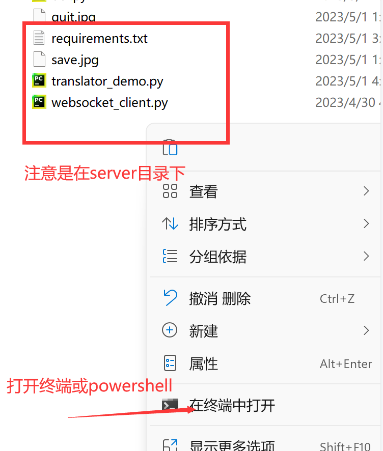

输入命令 `pip install -r requirements.txt` 回车。

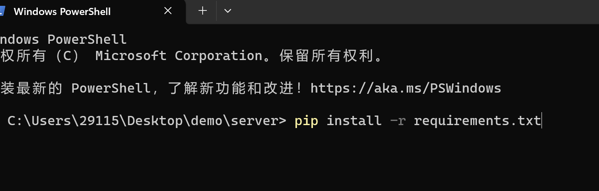

这样显示则代表安装成功。

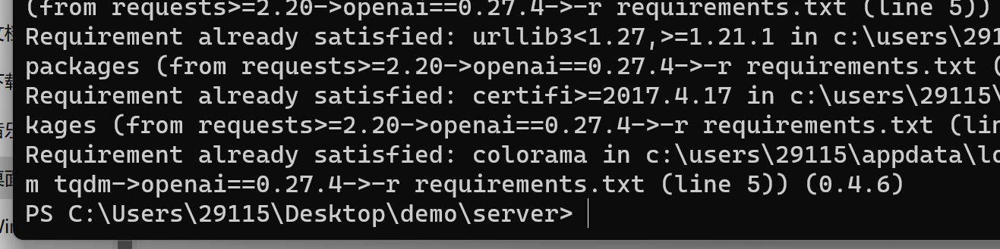

## 2. 安装tesseract

双击安装包。

按照图片指示操作。

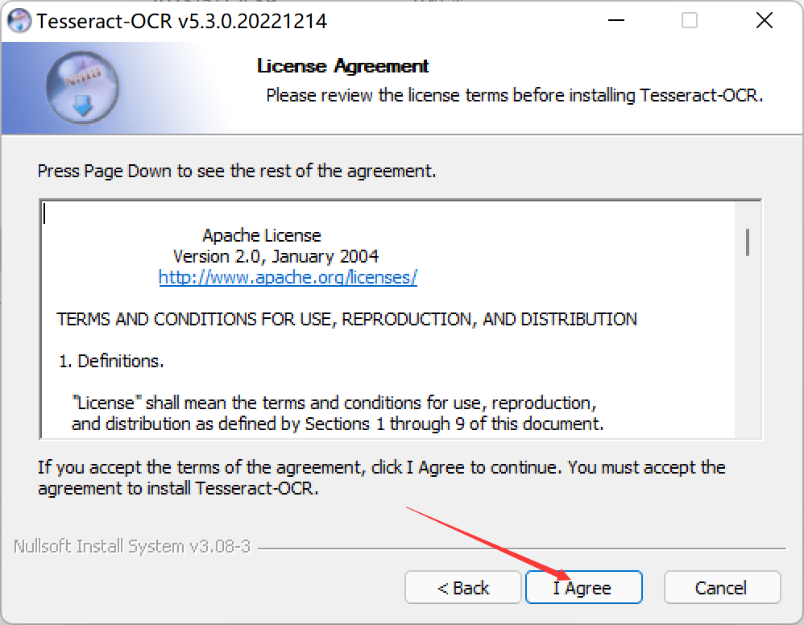

这里可以自定义安装目录。

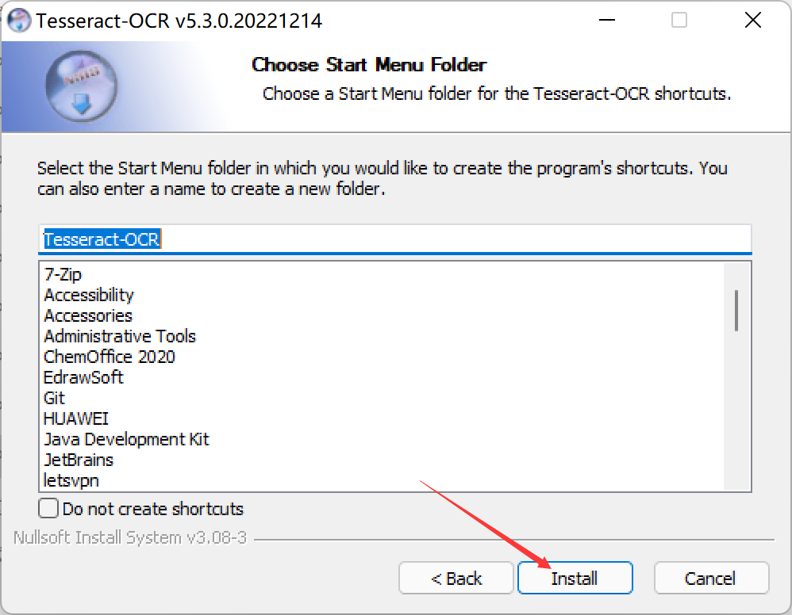

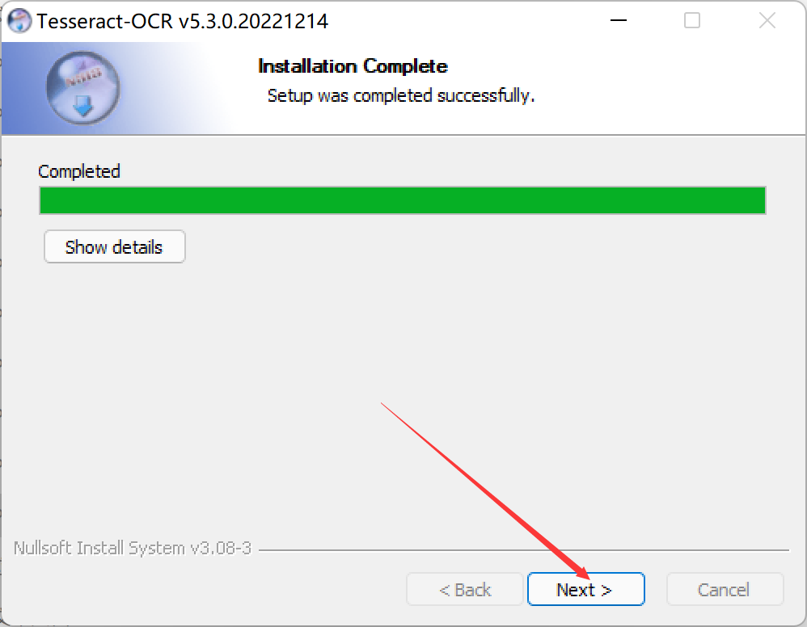

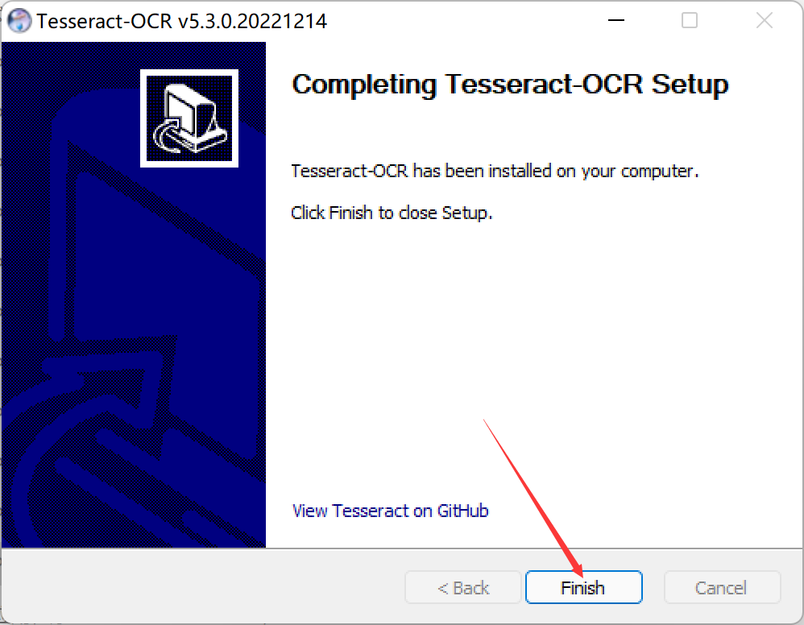

配置tesseract环境，打开高级系统设置。

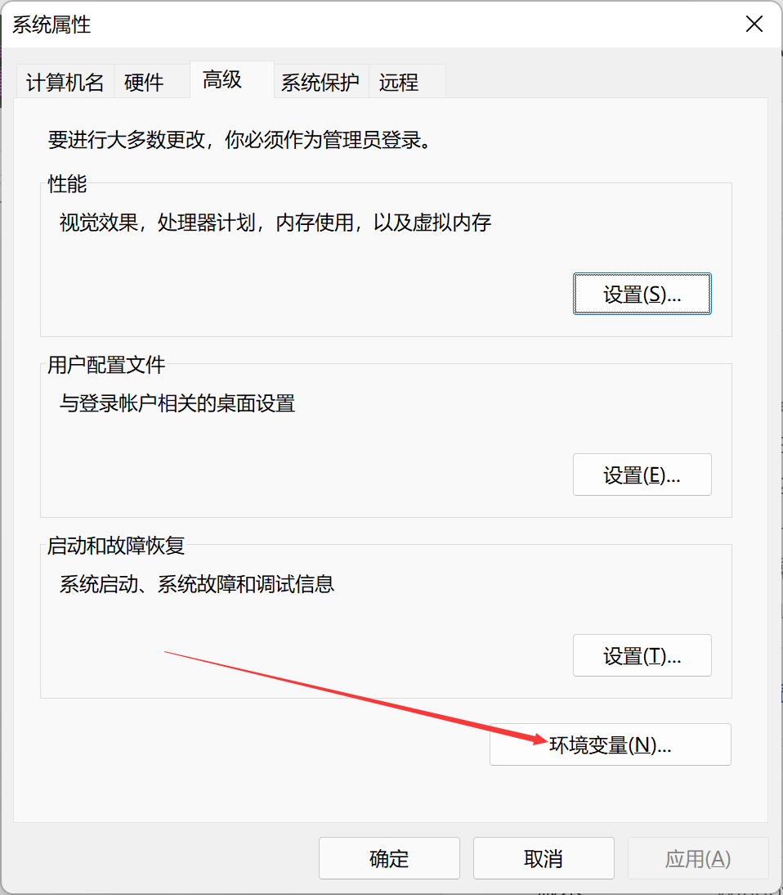

点击新建，填入刚才tesseract的安装目录。

修改后，点确定关闭就行。

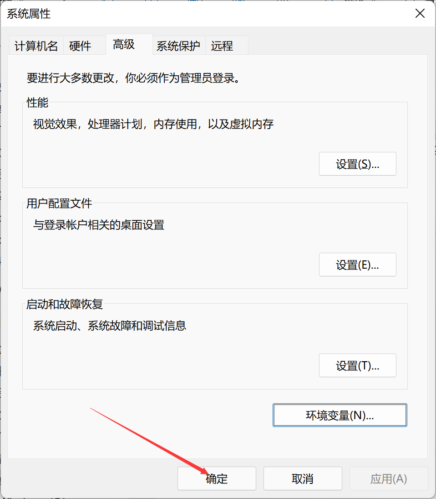

验证是否配置成功。

## 3. 启动服务

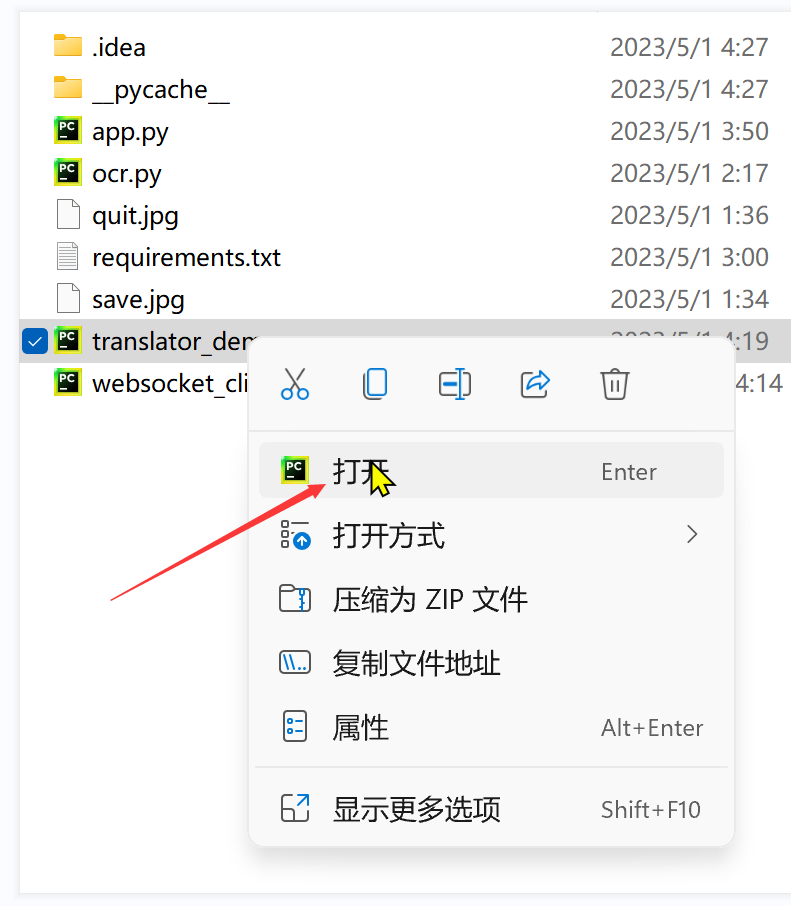

启动python后端服务。

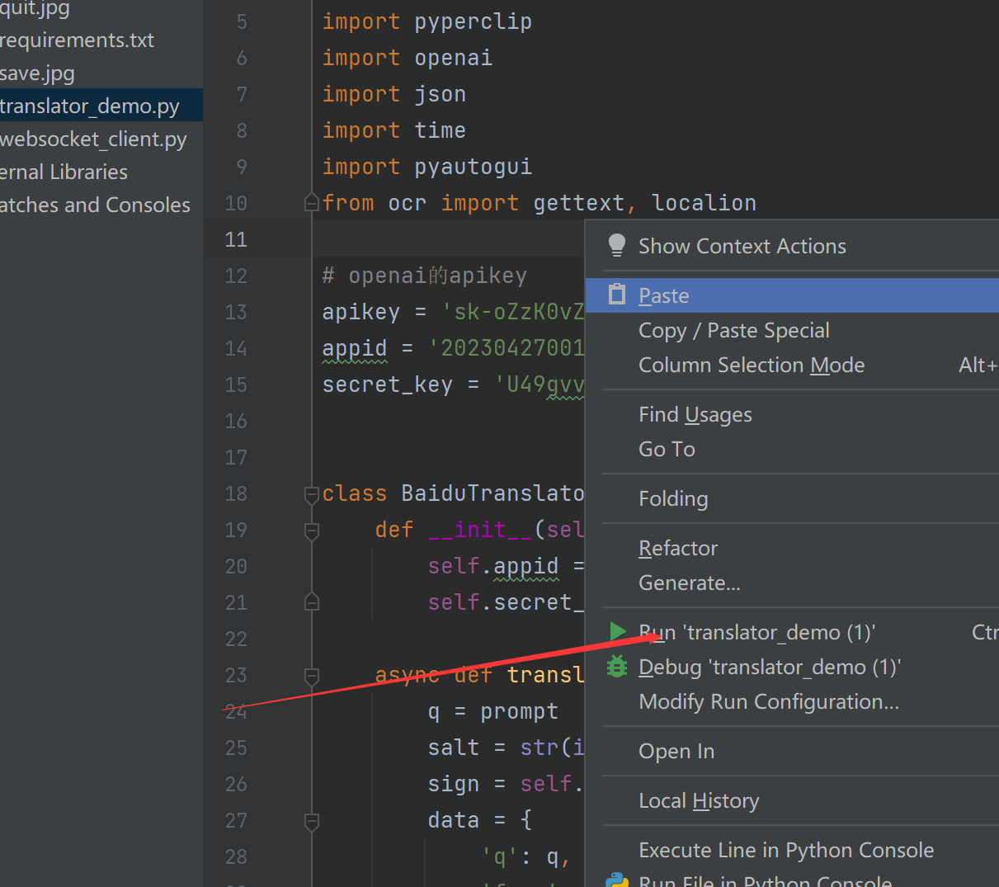

加载插件，打开谷歌浏览器，输入这个地址。

如果已经存在translate插件，要先移除。

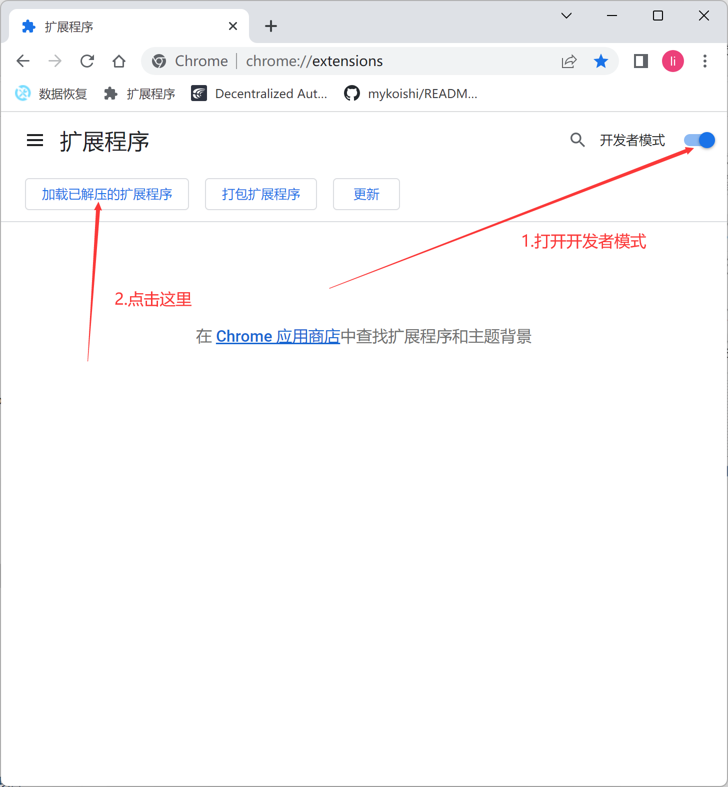

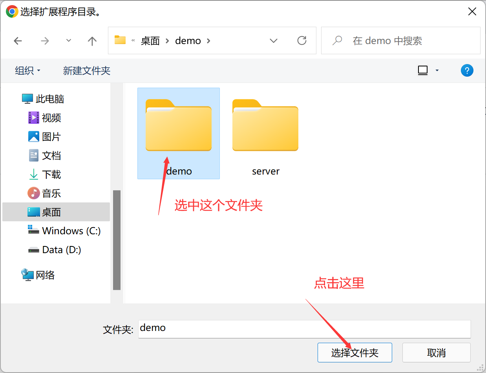

## 4.

